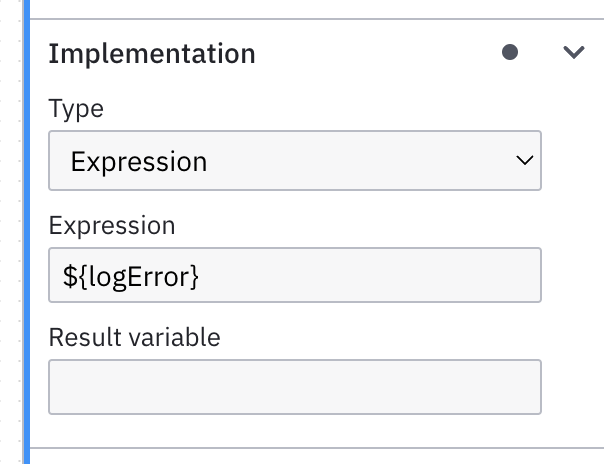
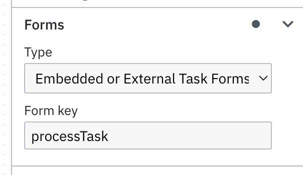
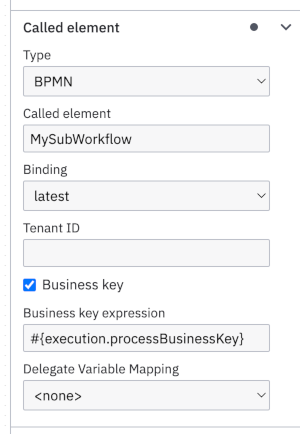

# Camunda 7 adapter for Spring Boot

Camunda 7 is a BPMN engine Java library which processes BPMN files deployed along with Java classes which implement the behavior of BPMN tasks. The engine uses a relational database to persist state and to store history processing data. Therefore, proper transaction handling is crucial e.g. to control behavior in special situations like unexpected errors of connected components. Due to the nature of the library and it's persistence Camunda 7 is a good fit up to mid-range scaled use-cases.

This adapter is aware of all the details needed to keep in mind on using Camunda 7 and implements a lot of best practices based on a long years experience.

## Content

1. [Usage](#usage)
    1. [Task definitions](#task-definitions) 
1. [Features](#features)
    1. [Worker ID](#worker-id)
    1. [Module aware deployment](#module-aware-deployment)
    1. [SPI Binding validation](#spi-binding-validation)
1. [Call-Activity](#call-activity)
1. [Multi-instance](#multi-instance)
1. [Message correlation IDs](#message-correlation-ids)
1. [Transaction behavior](#transaction-behavior)
1. [Workflow aggregate persistence](#workflow-aggregate-persistence)
   1. [JPA](#jpa)
   1. [MongoDB](#mongodb)
1. [Job-Executor](#job-executor)

## Usage

Just add this dependency to your project, no additional dependencies from Camunda needed:

```xml
<dependency>
  <groupId>org.camunda.community.vanillabp</groupId>
  <artifactId>camunda7-spring-boot-adapter</artifactId>
  <version>1.0.0</version>
</dependency>
```

If you want a certain version of Camunda (either community or enterprise edition) then you have to replace the transitive dependencies like this:

```xml
<dependency>
  <groupId>org.camunda.bpm.springboot</groupId>
  <artifactId>camunda-bpm-spring-boot-starter</artifactId>
  <version>7.20.1-ee</version>
</dependency>
<dependency>
  <groupId>org.camunda.bpm.springboot</groupId>
  <artifactId>camunda-bpm-spring-boot-starter-webapp-ee</artifactId>
  <version>7.20.1-ee</version>
</dependency>
<dependency>
  <groupId>org.camunda.community.vanillabp</groupId>
  <artifactId>camunda7-spring-boot-adapter</artifactId>
  <version>1.0.0</version>
  <exclusions>
    <exclusion>
      <groupId>org.camunda.bpm.springboot</groupId>
      <artifactId>camunda-bpm-spring-boot-starter</artifactId>
    </exclusion>
    <exclusion>
      <groupId>org.camunda.bpm.springboot</groupId>
      <artifactId>camunda-bpm-spring-boot-starter-webapp</artifactId>
    </exclusion>
  </exclusions>
</dependency>
```

*Hint:* This adapter is compatible with the configuration of the regular Camunda 7 Spring Boot auto-configuration. However, some additional configuration is described in the upcoming sections.

### Task definitions

As mentioned in [VanillaBP SPI](https://github.com/vanillabp/spi-for-java?tab=readme-ov-file#wire-up-a-task) a task is
wired by a task definition which is specific to the BPMS used. On using Camunda 7 this task-definition is defined
in Camunda's modeler's property panel.

For service tasks, in section "Implementation" set type to "Expression" and enter in input field
"Expression" an expression like shown in the image where the text "processTask" is the task definition:



*Hint:* If you are familiar to Camunda 7 this kind of expression might be new to you.
It is specific to *VanillaBP* and and replaces existing Camunda 7 expressions which are vendor-specific. 

For user tasks, in section "Forms" set type to "Embedded or External Task Forms" and
in input field "Form key" enter a key identifying the user task which
will be used as a task-definition. The value of form key is ignored by Camunda and there it is
not necessary to use a prefix as you may need for service task's task definition.



It is a rare case it is necessary to use one form for two different user tasks.
In this situation you can specify the same form key and annotate the workflow service's
method handling this user task by using the activities' ids as specified
in the modeler instead of the task definition:

```java
    @WorkflowTask(id = "ProcessTask1")
    @WorkflowTask(id = "ProcessTask2")
    public void processTask(
            final DemoAggregate demo,
            @TaskId final String taskId) throws Exception {
        ...
    }
```

## Features

### Worker ID

When using asynchronous task processing one has to define a worker id. There is no default value to avoid bringing anything unwanted into production. On using [VanillaBP's SpringApplication](https://github.com/vanillabp/spring-boot-support#spring-boot-support) instead of `org.springframework.boot.SpringApplication` [additional support](https://github.com/vanillabp/spring-boot-support#worker-id) is available.

### Module aware deployment

To avoid interdependencies between the implementation of different use-cases packed into a single microservice the concept of [workflow modules](https://github.com/vanillabp/spring-boot-support#workflow-modules) is introduced. This adapter builds a Camunda deployment for each workflow module found in the classpath. This requires to use [VanillaBP's SpringApplication](https://github.com/vanillabp/spring-boot-support#spring-boot-support).

Since Camunda is not aware of workflow modules the Camunda tenant-id is used to store the relationship between BPMNs and DMNs and their workflow module. As a consequence Camunda's tenant-ids cannot be used to distinguish "real" tenants anymore. To keep track easier, one might introduce user-groups for Camunda Cockpit which only shows resources of one workflow module.

Additionally, in a clustered environment during rolling deployment, to not start jobs by Camunda's job-executor originated by newer deployments add this setting in your application.yaml of the microservice' container:

```yaml
camunda:
  bpm:
    job-execution:
      deployment-aware: true
```

### SPI Binding validation

On starting the application BPMNs of all workflow modules will be wired to the SPI. This includes

1. BPMN files which are part of the current workflow module bundle (e.g. `classpath:processes/*.bpmn`)
1. BPMN files deployed as part of previous versions of the workflow module
   1. Older versions of BPMN files which are part of the current workflow module bundle
   1. BPMN files which are not part of the current workflow module bundle anymore
   
This ensures that correct wiring of all process definitions according to the SPI is done.

## Call-activity

The adapter uses Camunda 7's business key to associate the workflow aggregate
to the process instance. Therefor, on defining a call-activity in Camunda Modeler
it is mandatory in the property panel to tick the checkbox
`Business Key` and keep the default `Business key expression`:



## Multi-instance

For Camunda 7 all the handling of multi-instance is done under the hood.

*Hint:* If you want to be prepared to upgrade to Camunda 8 then use collection-based multi-instance since Camunda 8 does not support cardinality-based multi-instance. To avoid troubles on deserializing complex elements in your collection we strongly recommend to only use collections which consist of primitive values (e.g. in the taxi ride sample the list of driver ids).

## Message correlation IDs

On using receive tasks one can correlate an incoming message by its name. This means that a particular workflow is allowed to have only one receive task active for this particular message name. Typically, this is not a problem. In case your model has more than one receive task active you have to define unique correlation IDs for each receive task of that message name to enable the BPMS to find the right receive task to correlate to. This might be necessary for multi-instance receive tasks or receive tasks within a multi-instance embedded sub-process.

In Camunda 7 the correlation ID can be set using a local process variable. Since the name of this process variable is not standardized but the adapter needs to know about it, this implementation assumes the name of that variable according to this naming convention: `BPMN process ID` + `"-"` + `message name`. Setting a local variable can be done in the Camunda Modeler by defining an "input mapping" on the task.

For the taxi ride sample we have the BPMN process ID `TaxiRide` and e.g. the message name `RideOfferReceived`, so the local variable name is assumed as set to `TaxiRide-RideOfferReceived`. 

*Hint:* If you want to be prepared to upgrade to Camunda 8 then always set this correlation ID as a local variable since this is mandatory on using Camunda 8.

## Using Camunda multi-tenancy

Typically, on operating multiple workflow modules, one wants to avoid name clashes in Camunda (e.g. of event names, etc.).
Therefore, each workflow module is deployed to Camunda as a separate tenant using the workflow module's id as the tenant-id.

This behavior can be adapted.

**If you wish to define a custom tenant-id instead:**

```yaml
vanillabp:
  workflow-modules:
    ride:
      adapters:
        camunda7:
          tenant-id: taxiride
```

**If you want to disable multi-tenancy:**

```yaml
vanillabp:
  workflow-modules:
    ride:
      adapters:
        camunda7:
          use-tenants: false
```

## Transaction behavior

Defining the right Camunda 7 transactional behavior can be difficult. We have seen a lot of developers struggling with all the possibilities Camunda 7 provides regarding transactions. The implementation uses one particular best-practice approach and applies this to every BPMN automatically: Every BPMN task/element is a separate transaction.

In the very beginnings of Camunda it was sold as a feature to not require one transaction for each BPMN task/element. Meanwhile, computers are fast and cheap and avoiding data loss as well as building cheap software is more important than optimization of software. Therefore, it is better to have separate transactions rather than dealing with tricky transactional behavior.

To support this, on deploying bundled BPMN files the Camunda feature "Async before" is set on every task automatically. The only exceptions are user tasks, tasks using implementation type "external" as well as natural wait states like receive tasks because all of them implement the desired behavior implicitly. Additionally, the "Async after" is set on each and every task to ensure tasks completed successfully are not rolled back anymore.

If there is an exception in your business code and you have to roll back the transaction then Camunda's job of picking up the task has to be rolled back as well to ensure the retry-mechanism. Additionally, the `TaskException` is used for expected business errors handled by BPMN error boundary events which must not cause a rollback. To achieve both one should mark the service bean like this:

```java
@Service
@WorkflowService(workflowAggregateClass = Ride.class)
@Transactional(noRollbackFor = TaskException.class)
public class TaxiRide {
```

On introducing VanillaBP one might to keep some of the BPMNs unchanged. Therefore, automatic re-defining "Async before" and "Async after" can be disabled in general:

```yaml
vanillabp:
  workflow-modules:
    ride:
      adapters:
        camunda7:
          use-bpmn-async-definitions: true
```

or just for particular process definitions:

```yaml
vanillabp:
   workflow-modules:
     ride:
       workflows:
         Ride:
           adapters:
             camunda7:
               bpmn-async-definitions: true
```

## Workflow aggregate persistence

### JPA

JPA is the default persistence. No additional configuration is required when using with Camunda 7.

### MongoDB

When using MongoDB for persistence an additional RDBMS is necessary to operate Camunda 7. This is
done by providing this configuration class:

```java
@Configuration
public class MongoDbSpringDataUtilConfiguration {

    @Bean
    @ConditionalOnProperty("spring.datasource.url")
    public DataSource camundaBpmDataSource(
            final DataSourceProperties dataSourceProperties) {
        return dataSourceProperties
                .initializeDataSourceBuilder()
                .type(HikariDataSource.class)
                .build();
    }

    @Bean
    @ConditionalOnProperty("spring.datasource.url")
    public PlatformTransactionManager camundaBpmTransactionManager(
            @Qualifier("camundaBpmDataSource") DataSource dataSource) {
        return new DataSourceTransactionManager(dataSource);
    }

    @Bean
    @Primary
    public MongoTransactionManager transactionManager(
            final MongoDatabaseFactory dbFactory) {

        return new MongoTransactionManager(dbFactory);

    }

    @Bean
    public MongoDbSpringDataUtil mongoDbSpringDataUtil(
            final ApplicationContext applicationContext,
            final MongoDatabaseFactory mongoDbFactory,
            @Nullable final MongoConverter mongoConverter) {

        return new MongoDbSpringDataUtil(applicationContext, mongoDbFactory, mongoConverter);

    }
}
```

*Hint:* Note that `MongoTransactionManager` is marked as `@Primary`. The bean `camundaBpmTransactionManager`
is only used by Camunda 7 and does NOT form a XA transaction and therefore you might experience
data-inconsistency in case of MongoDB or RDBMS fails.

## Job-Executor

The Camunda job-executor is responsible for processing asynchronous continuation of BPMN tasks. It has a delay due to polling the database for jobs (see [Backoff Strategy](https://docs.camunda.org/manual/7.20/user-guide/process-engine/the-job-executor/#backoff-strategy)). If there is manual interaction to the process-engine (e.g. process started, message correlated or user-task completed) you want asynchronous tasks to be completed as soon as possible. For example, you want to give feedback in the UI of a "validation" task following a user-task. Therefore, this adapter wakes up the job-executor to check for new jobs after a manual interaction's transaction is completed.

In cloud environments one typically wants to free resources in idle times to not waste money (at protect the environment :deciduous_tree:) since resources are charged by time of usage. Camunda's job-executor using a polling strategy to find new jobs which either  keeps the database in use or introduces huge delays of execution if max-delays are set to big values. This Camunda 7 VanillaBP adapter alters this behavior by keeping the Job-Executor sleep until the next timed job's due-date (e.g. timer-event). In conjunction with waking up the job-executor in case of manual interaction this helps to minimize database usage.

This feature is *experimental and disabled by default* and if wanted one needs to enable it by using this Spring property:

```yaml
camunda:
  bpm:
    job-execution:
      wakeup: true
```

However, if enabled you have to [set a DB index](https://docs.camunda.org/manual/7.6/user-guide/process-engine/the-job-executor/#the-job-order-of-job-acquisition) as hinted on starting your Spring Boot application with this feature enabled:

> VanillaBP's job-executor is using `jobExecutorPreferTimerJobs=true`
> and `jobExecutorAcquireByDueDate=true`. Please add DB-index according
> to https://docs.camunda.org/manual/7.20/user-guide/process-engine/the-job-executor/#the-job-order-of-job-acquisition

*Hint:* This feature requires to enable Spring Boot's scheduled tasks [as described here](https://www.baeldung.com/spring-scheduled-tasks#enable-support-for-scheduling).
